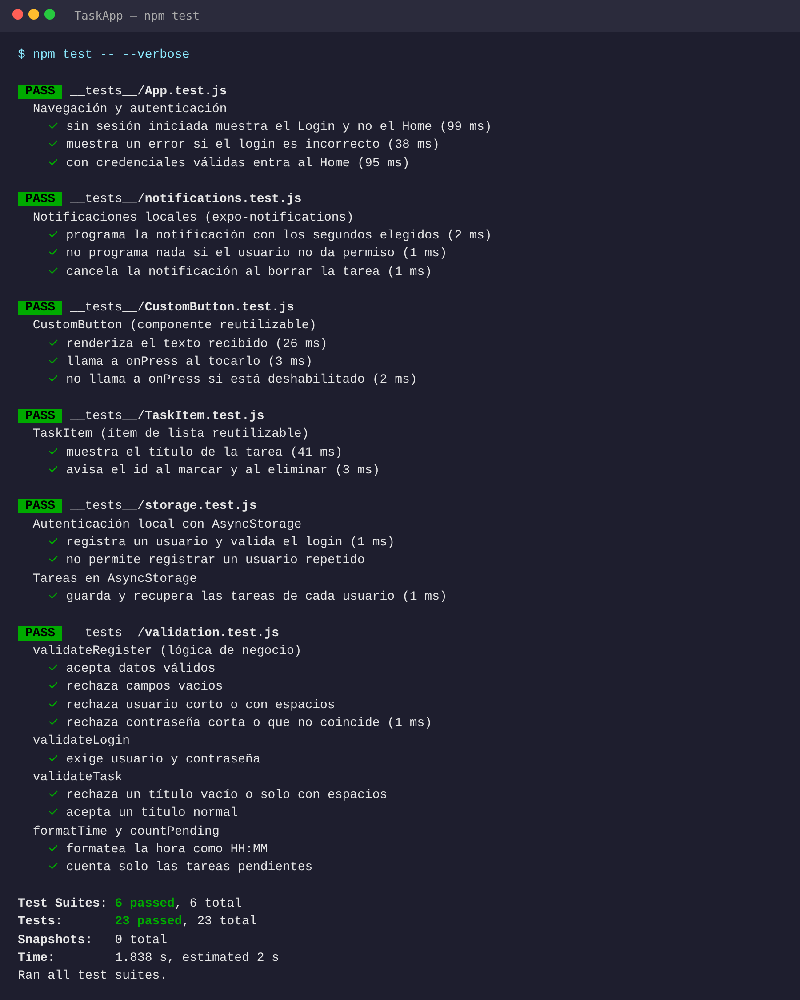

# ✅ TaskApp – Gestor de Tareas (React Native + Expo)

Trabajo práctico individual de React Native – Istea.
**Alumno:** Bruno Castillo

## Tema elegido

**✅ Gestor de tareas:** tareas con título y recordatorio por notificación local.

## 🎬 Video demo

▶️ **[Ver demo en YouTube](https://youtube.com/shorts/OYGY6Do-X_E)** (1–2 minutos)

## Funcionalidades

| Requisito | Cómo se cumple |
|---|---|
| **Componentes y estilos** | `View`, `Text`, `TextInput`, `Button`, `TouchableOpacity`, `FlatList`. Todos los estilos con `StyleSheet`. |
| **Componentes reutilizables** | `CustomButton` (botón con variantes), `TaskItem` (ítem de la lista) y `FormInput` (campo con etiqueta). |
| **Navegación (Stack)** | React Navigation con *Native Stack*: **Login → Registro → Home → Nueva tarea**. |
| **Autenticación local** | Registro con usuario y contraseña (con validaciones) y login que valida contra los usuarios guardados en AsyncStorage. Las pantallas Home y Nueva tarea **solo existen si hay sesión iniciada**, así que no se puede entrar sin loguearse. Botón **Salir** para cerrar sesión. |
| **Persistencia (AsyncStorage)** | Se guardan los usuarios, la sesión activa y las tareas de **cada usuario por separado**. Los datos siguen al cerrar y volver a abrir la app. |
| **Crear elementos** | Pantalla **Nueva tarea** con título y recordatorio. Además (opcional): marcar como hecha ✓, **eliminar** con confirmación y contador de pendientes. |
| **Notificación local** | Con **expo-notifications** (sin Firebase). Al crear una tarea se elige el aviso (**5 seg** por defecto, 10 seg, 1 min, 5 min o 30 min) y llega la notificación “⏰ Tarea pendiente”. Si se borra la tarea, el aviso se cancela. |
| **Tests** | Jest (`jest-expo`) + React Native Testing Library: **23 tests en 6 archivos**, se corren todos con `npm test`. |

### Tests (`__tests__/`)

- `CustomButton.test.js` – **componente**: renderiza el texto, responde al toque y no responde si está deshabilitado.
- `TaskItem.test.js` – **componente**: muestra la tarea y avisa al marcarla o eliminarla.
- `validation.test.js` – **lógica**: validación de registro, login y tareas, formato de hora y conteo de pendientes.
- `storage.test.js` – registro, login y guardado de tareas en AsyncStorage.
- `notifications.test.js` – programación y cancelación de la notificación.
- `App.test.js` – navegación: sin sesión se ve el Login, un login incorrecto muestra error y uno correcto entra al Home.

### ✅ Evidencia: tests pasando



## Cómo ejecutar la app

### Opción A – Expo Go (recomendada)

Requisitos: Node.js 20 o superior y la app **Expo Go** en el celular (Play Store / App Store).

```bash
git clone https://github.com/bruno-istea/TaskApp.git
cd TaskApp
npm install
npx expo start
```

Escaneá el código QR con Expo Go (Android) o con la cámara (iPhone). El celular y la compu tienen que estar en la misma red Wi-Fi; si no conecta, usá `npx expo start --tunnel`.

### Opción B – APK (Android, sin computadora)

El repo compila el APK automáticamente con GitHub Actions (`.github/workflows/build-apk.yml`) cada vez que se sube código a `main`.

1. Entrá desde el celular a la sección **Releases** del repositorio.
2. Descargá **app-release.apk** del último build.
3. Abrilo y permití **instalar apps de origen desconocido** si Android lo pide.

### Correr los tests

```bash
npm test
```

### Probar la notificación

1. Registrate e iniciá sesión.
2. Tocá **+ Nueva tarea**, escribí un título y dejá el aviso en **5 seg**.
3. Aceptá el permiso de notificaciones la primera vez.
4. A los 5 segundos llega “⏰ Tarea pendiente”, con la app abierta o minimizada.

> Conviene probarla en un **celular real**: en el emulador las notificaciones suelen fallar.

## Estructura del proyecto

```
App.js                         # Navegación (Stack) + protección de pantallas
src/
├── components/                # CustomButton, TaskItem, FormInput (reutilizables)
├── context/AuthContext.js     # Sesión del usuario (login / logout)
├── screens/                   # Login, Register, Home, AddTask
├── services/notifications.js  # Notificaciones locales con expo-notifications
├── storage/storage.js         # AsyncStorage: usuarios, sesión y tareas
├── utils/validation.js        # Validaciones y funciones puras (testeadas)
└── theme.js                   # Colores
__tests__/                     # Tests con Jest + RNTL
```

## Tecnologías

Expo SDK 57 · React Native · React Navigation 7 (Native Stack) · AsyncStorage · expo-notifications · Jest (jest-expo) · React Native Testing Library

> Nota: según la consigna no hay backend y las contraseñas se guardan sin cifrar en AsyncStorage.
